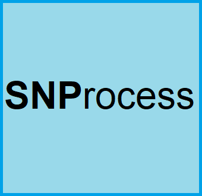
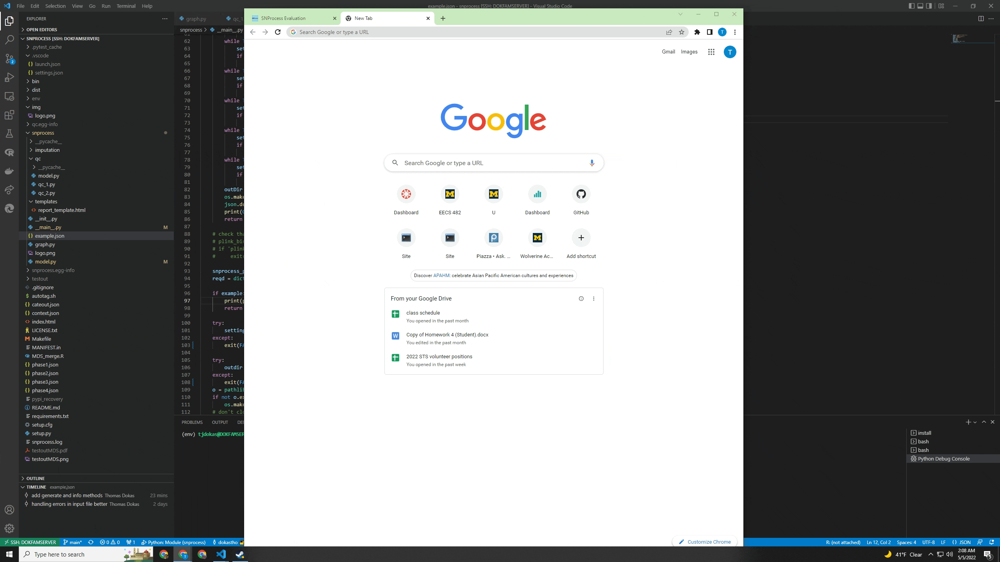

# SNProcess


  by Thomas Dokas
  
  <dokastho@umich.edu>

  SNProcess is a Single Nucleotide Polymorphism (SNP) Quality Control pipeline, written in python the procedure was developed by [Shing Wan Choi @ Mount Sinai, NYC](https://github.com/choishingwan/PRS-Tutorial) and for more info check out this [tutorial](https://github.com/MareesAT/GWA_tutorial).

## How to Install
  SNProcess is very easy for any user to install. It's listed on [pypi](https://pypi.org/project/snprocess), which means you can install it using pip:
  ```bash
  pip install snprocess
  ```
  and you can upgrade it by running:
  ```bash
  pip install snprocess --upgrade
  ```

## Results
  SNProcess will run a QC pipeline and produce the output files **qcplink.xyz**

## Evaluation
  SNProcess compiles relevant information with regard to the QC process into an HTML webpage. This can be found in your specified output folder, in the file **index.html**. SNProcess also provides a way of viewing this file easily, just run:
  ```bash
  snprocess -i
  ```
  and go to **localhost:8008**. This is a way of viewing this generated webpage using your own computer as a host. Pretty cool, right?

  

## FAQ
  * What should my input json look like? *Run snprocess -e for an example json printed to your console, or snprocess -g to generate your own to your output directory*
  * SNProcess won't run for me! What's wrong? *SNProcess is a somewhat unique program in that it uses [plink](https://www.cog-genomics.org/plink/1.9/) as a driver/helper. Make sure that's installed. If the issue persists, please file a bug report at the snprocess [repo](https://github.com/dokastho/snprocess)*

# More About SNProcess

## QC1
Steps for QC:
1. Check missingness and generate plots
2. Remove individuals with high missingness
3. Remove individuals with outlying gender SNP's
4. Select autosomal SNPs only and filter out SNPs with low minor allele frequency (MAF)
5. Delete SNPs not in the Hardy-WEinberg equilibrium (HWE)
6. Heterozygosity and LD Pruning

## QC2
This portion of the pipeline compares the user data with data in the 1,000 genome project and produces graphs that show the population stratification based on race & ethnicity

# TODO
* [ ] move final rscripts to python
* [ ] use tmp folder for files that arent used in index.html and qcplink.xyz
